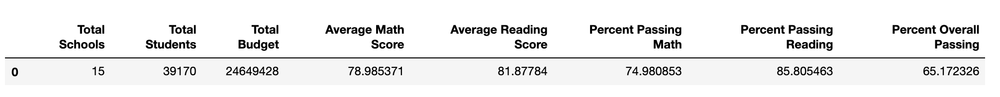
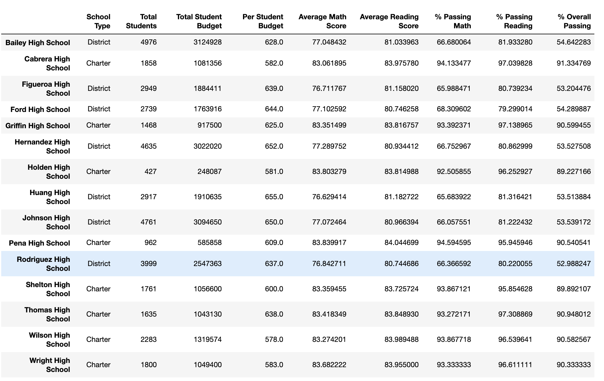
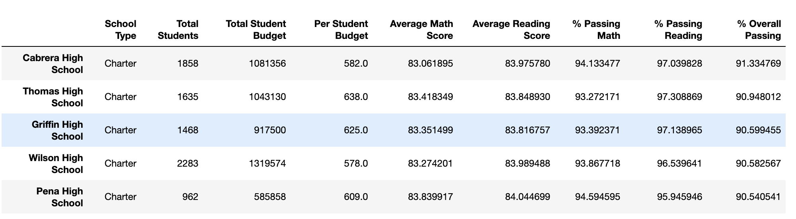
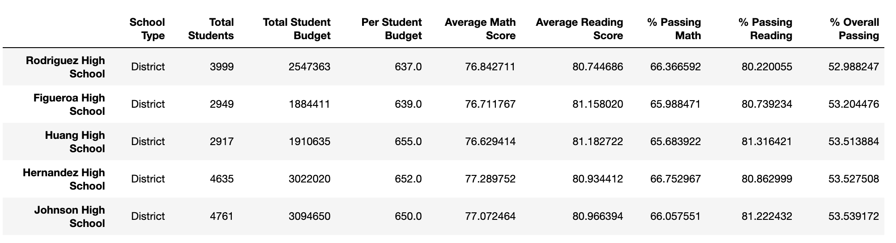
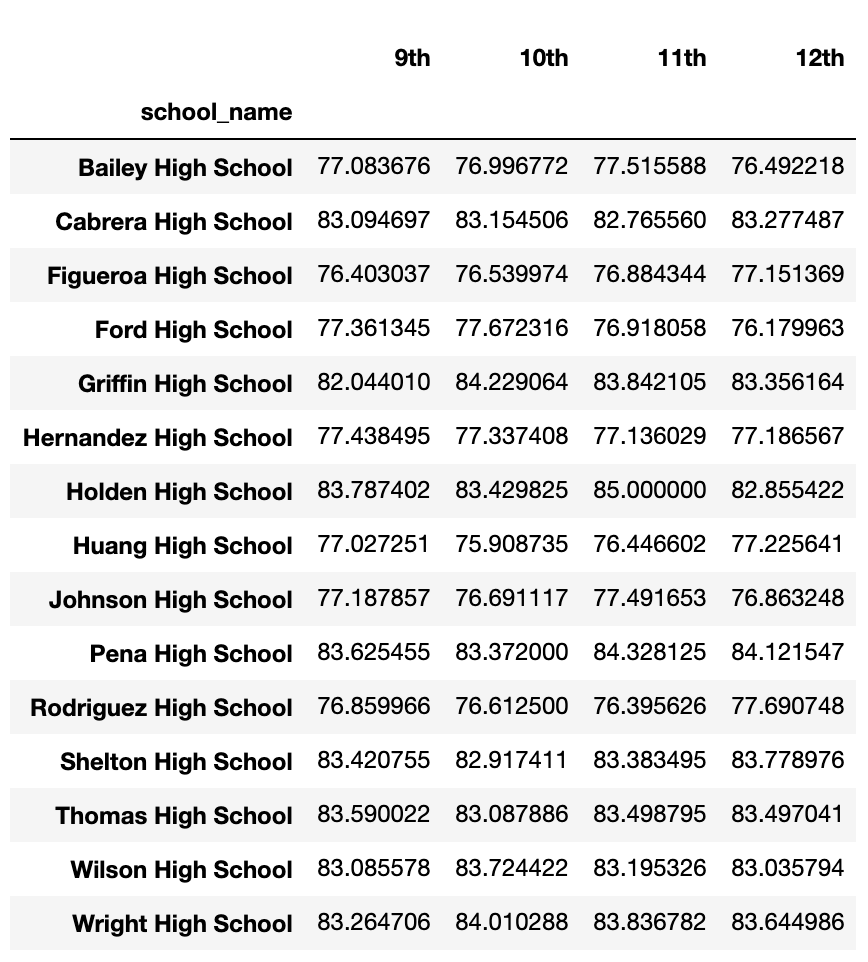

# Standardized Testing Data Analysis

## PyCitySchools Performance Analysis

### Background Information 
In this theoretical application, I assumed the role as Chief Data Scientist for a city's school district -- in this role, I was tasked to analyze the district-wide standardized test results. Provided datasets included every student's math and reading scores, as well as various information on the schools they attend. In this project, I successfully aggregated the data and showcased obvious trends in school performance in order advise strategic decisions regarding future school budgets and priorities.

Subsequent sections of statistical analyses and dataframe visualizations are as follows:

### District Summary

* I successfully created a high level snapshot (in table form) of the district's key metrics, including:
  * Total Schools
  * Total Students
  * Total Budget
  * Average Math Score
  * Average Reading Score
  * % Passing Math (The percentage of students that passed math.)
  * % Passing Reading (The percentage of students that passed reading.)
  * % Overall Passing (The percentage of students that passed math **and** reading.)

### School Summary

* I dove deeper in the analysis to provide an overview table that summarizes key metrics about each school, including:
  * School Name
  * School Type
  * Total Students
  * Total School Budget
  * Per Student Budget
  * Average Math Score
  * Average Reading Score
  * % Passing Math (The percentage of students that passed math.)
  * % Passing Reading (The percentage of students that passed reading.)
  * % Overall Passing (The percentage of students that passed math **and** reading.)

### Top Performing Schools (By % Overall Passing)

* Once each school was individually analyzed, I created a table that highlights the top 5 performing schools based on % Overall Passing. This analysis includes:
  * School Name
  * School Type
  * Total Students
  * Total School Budget
  * Per Student Budget
  * Average Math Score
  * Average Reading Score
  * % Passing Math (The percentage of students that passed math.)
  * % Passing Reading (The percentage of students that passed reading.)
  * % Overall Passing (The percentage of students that passed math **and** reading.)

### Bottom Performing Schools (By % Overall Passing)

* In comparison, I created a table that highlights the bottom 5 performing schools based on % Overall Passing. This analysis includes all of the same metrics as above.

### Math Scores by Grade

* In order to observe core math performances, I created a table that lists the average Math Score for students of each grade level (9th, 10th, 11th, 12th) at each school.

### Reading Scores by Grade

* To alternately observe core reading performances, I created a table that lists the average Reading Score for students of each grade level (9th, 10th, 11th, 12th) at each school.

### Scores by School Spending

* An important aspect of this analysis was to observe standardized test perfomance in comparison to each school's spending ranges, school size, and school type. I created a table that breaks down school performances based on average Spending Ranges (per student) that was divided into four appropriate categories:
  * Average Math Score
  * Average Reading Score
  * % Passing Math (The percentage of students that passed math.)
  * % Passing Reading (The percentage of students that passed reading.)
  * % Overall Passing (The percentage of students that passed math **and** reading.)

### Scores by School Size

* I repeated the same analysis breakdown as above but focused primarily on relation to school size (Small, Medium, Large).

### Scores by School Type

* I repeated the same analysis breakdown as above but focused primarily on relation to school type (Charter vs. District).

### Copyright

Trilogy Education Services © 2019. All Rights Reserved.
